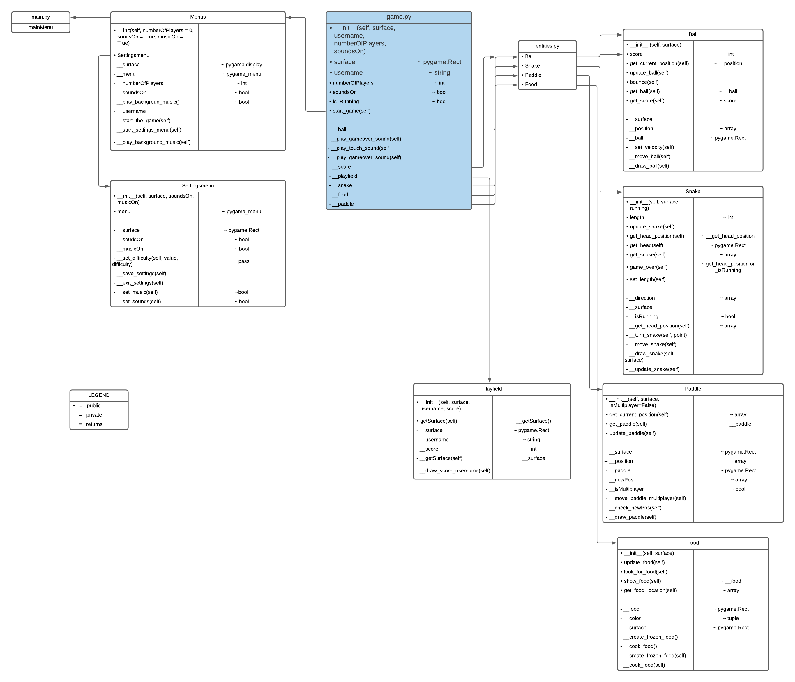
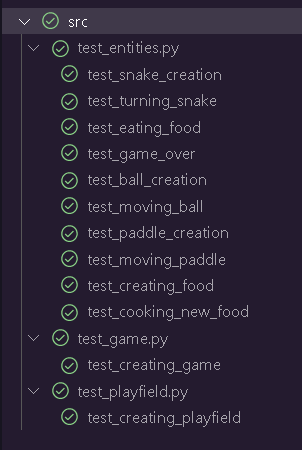

# SnakePONG™®

## Intro

We present you, SnakePONG™®! A mix between the legendary games,
Snake (1997) and Pong (1972)! If that doesn't sound like a recipe for epicness, we don't know what will.

---

### The Rules

You, the player, will play as the snake and try to score into the computer's "goal".

**_BUT_** there is a _twist_ !

You can also try and eat some delicious candy while playing which will increase the length of your snake.

Watch out though, while it might make it easier to hit the ball, you will get tangled up more quickly and possibly **LOSE** the game!

---

### Features

1. **_Unparalleled gameplay_**
2. **_Fully controllable snake_**
3. **:candy: _LOTS OF CANDY_ :candy:**

## Installation

To install this project and make sure you can enjoy the full SnakePONG™® experience as intended by its creators, please follow the steps below precisely.

1. Clone into the GitHub repository

You can easily clone into the GitHub repository or classroom called *snakepong-sukkelaars* with the commands below.
The GitHub Classroom is called the way it is because the creators of the game used to be real programming *sukkelaars*, but have become real professionals!

```bash
git clone [the password-protected SSH key/the web URL - goes here]
```

2. Installing the necessary libraries

Use the commands below to install the necessary libraries for running the game in its full madness. 
Please make sure you are using the latest version of *pip* and *python* to run these commands, you can check this [here](https://pip.pypa.io/en/stable/installing/)!

```bash
pip install pygame pygame-menu collision
```

After you have succeeded in installing everything correctly you can head over to the next item on the list: **How to actually play the game?**

## How to play

Playing this is game is as easy as passing the exams of mister Cordemans at the Vives Hogeschool in Bruges - but wait ... Which mister Cordemans and which exams are we talking about :o

Nevermind let's not get sidetracked here because starting up the game is rather easy, but is playing the game as easy? Only time will tell - ay guess that's life, not?

To play the game simply open up the the location of the repo in any CLI (PowerShell or Windows Terminal are confirmed to be working) and use the command below to fire up the game!

```bash
python ./src/main.py
```

## Components

### Main.py

The first step of our code. We simply call for the menu to be opened

---

### Menus.py

Launching the game first takes you to our neat menu, here you can change the settings, your name or press "play" to begin enjoying the new GOTY of Python games.


---

### Settings

If you were to go into the settings, you can change a bunch of stuff.

Want to play with a friend? That's possible! Just click on the "Players" option to increase the player count to 2!

Had enough of the funky soundtrack or the sound effects? Disable them by the click of a button!

We would've liked to also implement difficulty levels and different playing fields but due to time strain and other assignments we had to cut our losses. Still, we are very happy how our game ended up looking!


---

### Playfield.py

The name says it all, here we made our playingfield including the borders.

---

### Entities.py

Here we have programmed all our interactive objects, how the ball moves and bounces, how our :candy: spawns, how our snake is made and controlled and how the paddle moves on its own!

**_FUN FACT: For our snake we are using a deformed (kind of handicapped) version of a SingleLinkedList!_**

---

#### The Snake


---

#### The Paddle


---

#### The Food


---

#### The Ball


---

### Game.py

This is where the main game loop takes place and where all our code comes together in one nice little package.


## Diagram

Below you can find a diagram that show how all of our code is related:



## Tests

We wrote a bunch of tests to make sure the functionality of the game is guaranteed!



## Trajectory

**Done** | **Feature** | **Difficulty**
:---: | ---- | ----
 :heavy_check_mark: | Menus | :star::star:
 :heavy_check_mark: | Playing Field | :star:
 :heavy_check_mark: | Snake | :star::star::star:
 :heavy_check_mark: | Food | :candy::candy:
 :heavy_check_mark: | Ball | :star::star::star:
 :heavy_check_mark: | Paddle | :star::star:
 :heavy_check_mark: | Tests | :star::star:
 :heavy_check_mark: | Autonomous Responses | :star::star::star:
 :x: | AI | :star::star::star::star::star:

## Possible additions to the game

We were looking at adding a couple of things to our game in addition to the already amazing display and feel of it - just to give you that extra piece of awesomeness on your toast of SnakePONG!

Unfortunately we were held back by a lack of time and/or a lot of other assignments sent out by other teachers at the Vives Hogeschool in Bruges.
Thus meaning we endend up with this beauty of a game but with some possibilities of improvement.
In the list below we are summorizing what we had in mind and already prepared in our code but just simply didn't find the time to write the actual functions and variables to really implement it:

1. Making a login screen where users can login with their name and password
2. Adding a JSON data file to the project that saves players and their progress/settings/preferences
3. Adding some functionality to the settings menu (the difficulty and playfield size remain the same no matter what your settings are)
4. Adding more ways of dying and/or winning in both Singleplayer and Multiplayer game modes
5. Creating a nicer GUI (Graphical User Interface), for example more pictures - cleaner menu etc...

## Resources used during the project

- [PyGame Documentation](https://www.pygame.org/docs/)
- [PyGame-menu Documentation](https://pygame-menu.readthedocs.io/en/latest/)
- [PyGame - The Ultimate Tutorial](https://codakid.com/pygame-tutorial/)
- [PyGame - Game Development for beginners](https://www.upgrad.com/blog/pygame-tutorial-for-beginners/)
- [Snake with PyGame example](https://www.edureka.co/blog/snake-game-with-pygame/)
- [Snake with PyGame example 2](https://pythonspot.com/snake-with-pygame/)
- [PyGame - Creating a menu example](https://pythonprogramming.net/pygame-start-menu-tutorial/)
- [Pong with PyGame example](https://www.geeksforgeeks.org/create-pong-game-using-python-turtle/)
- [Pong with PyGame example 2](https://gist.github.com/vinothpandian/4337527)
- [Pong - adding a bouncing ball](https://www.101computing.net/pong-tutorial-using-pygame-adding-a-bouncing-ball/)

In addition to the websites that are listed above we watched some tutorials on [YouTube](https://www.youtube.com). Some examples are listed below:

- [Pong - moving the ball](https://www.youtube.com/watch?v=Hw1H3rG3POM&ab_channel=TokyoEdtech)
- [Pong - PyGame tutorial](https://www.youtube.com/watch?v=9bBgyOkoBQ0&ab_channel=Kite)
- [Twitter GIF showing how it's done](https://twitter.com/Pcordemans/status/979060961645678593)